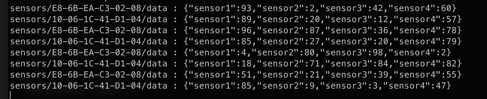

# Instalacja MQTT:

Tworzymy plik passwd w którym umieszczamy login i hasło do brokera MQTT w formacie:

```
login:hasło
```

Następnie uruchamiamy skrypt:

```
docker exec mosquitto mosquitto_passwd -U /etc/mosquitto/passwd
```

jesli chcemy dodac nowych uzytkownikow:

```
docker exec mosquitto mosquitto_passwd -b /etc/mosquitto/passwd user password
```

Nalezy pamietac aby zrestartowac kontener mosquitto po dodaniu nowych uzytkownikow.


Przykład danych:

